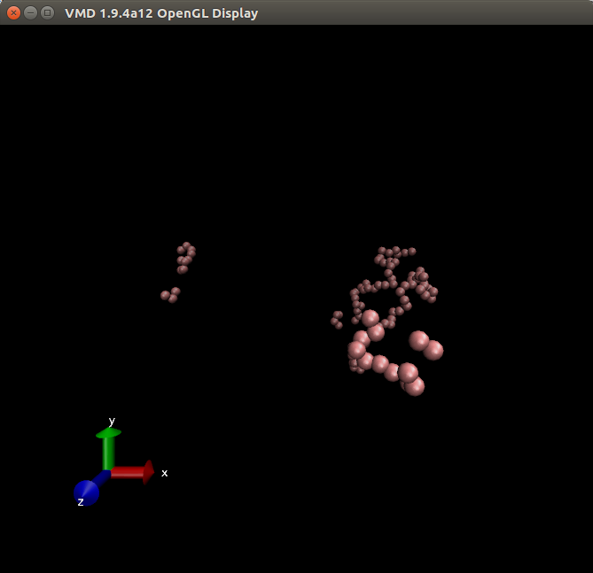
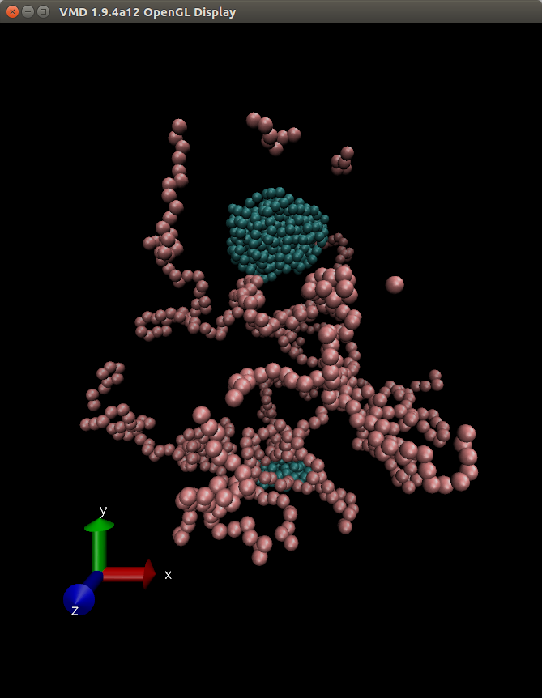
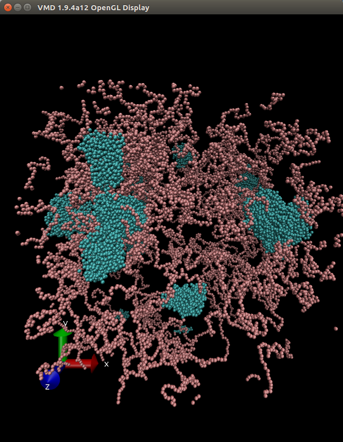
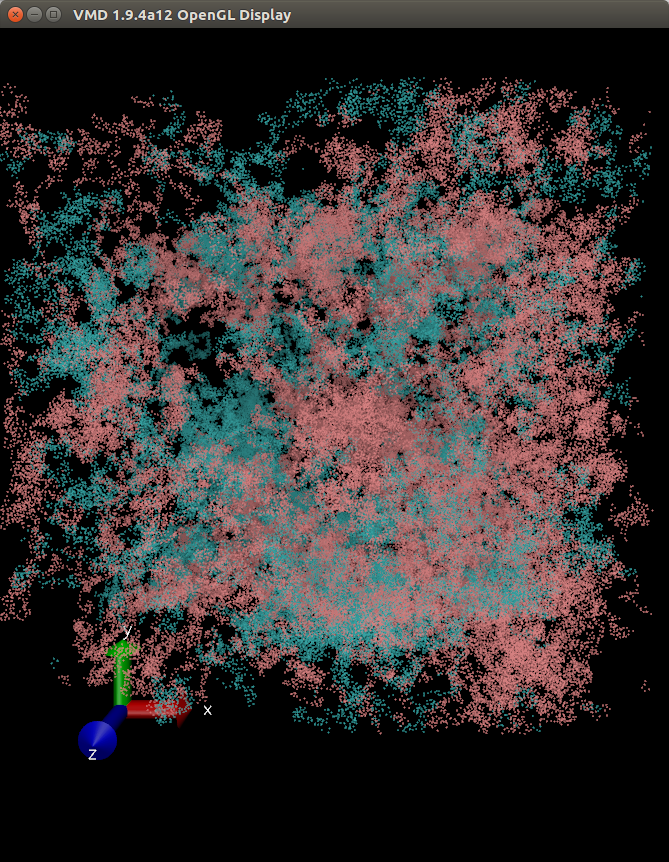
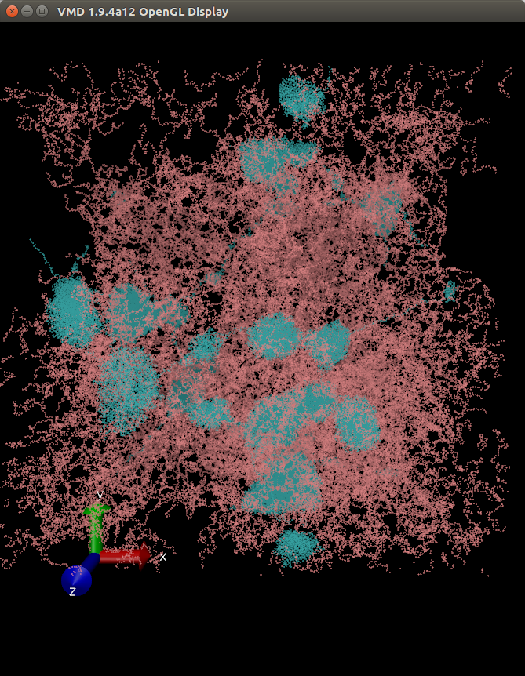
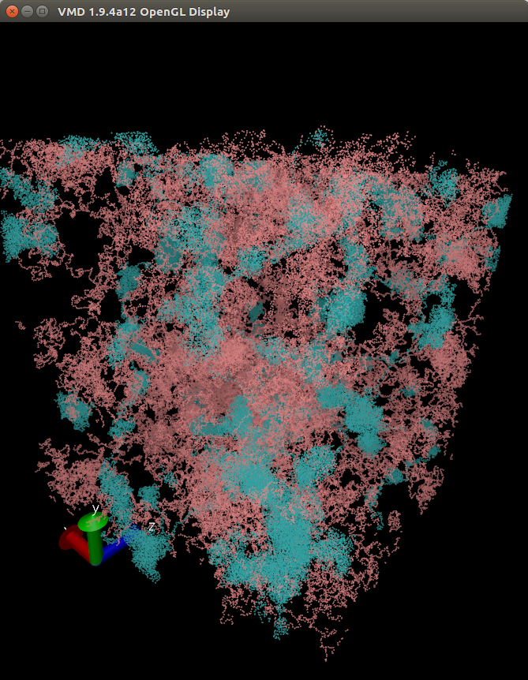
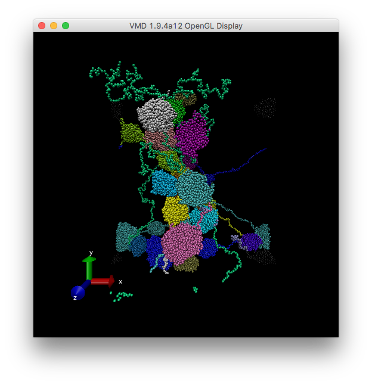

# A Model for the Human Genome
This page describes a simple copolymer hoomd simulation that is a good model for the Human Genome.

Hoomd can be downloaded from: http://glotzerlab.engin.umich.edu/hoomd-blue/
On Linux and MacOS type:

>$ conda config --add channels conda-forge

>$ conda install hoomd

Unfortunatly Hoomd does not currently compile or run on Windows.
If GPU computation is required on MacOS Hoomd must be compiled from source.

Adapted from:https://en.wikipedia.org/wiki/Chromosome

The human genome consists of 24 chromosomes with a total size of 3Gb.  Aiden et al. 2014 produced a 1kB resolution Genome Contact Map(below single gene resolution).  Contact domains (∼185 kb) segregate into six nuclear subcompartments with distinct histone marks.

## We begin with a random polymer model
These models are adapted from: 
https://lost-contact.mit.edu/afs//umich.edu/user/j/o/joaander/Public/hoomd-web/doc/page_example_scripts.html

For more information on the model in this script, see "Micellar crystals in solution from molecular dynamics simulations" J. Chem. Phys. 128, 184906 (2008); DOI:10.1063/1.2913522 http://link.aip.org/link/?JCPSA6/128/184906/1

## Models

1. <a href="https://github.com/fergusonml/Human-Genome-Model/blob/master/create%20random%20polymer.ipynb">Random Polymer Model</a>
This simulates a random polymer of 100 beads.

2. <a href="https://github.com/fergusonml/Human-Genome-Model/blob/master/create%20random%20polymer2.ipynb">Block CoPolymer Model</a>
This simulates a block copolymer of 1000 beads.  It will run on a cpu or a gpu which can be changed using the command >hoomd.context.initialize(--mode=cpu)
or
>hoomd.context.initialize(--mode=gpu)

Once context is initialized the python kernel must be restarted to change it.

3. <a href="https://github.com/fergusonml/Human-Genome-Model/blob/master/human_genome_180kb_resolution.ipynb">A Model for the Human Genome at 100kb resolution</a>
This simulates 24 block copolymers of 1000 beads each.  Here each bead approximates a single contact domain (e.g. an enhancer promoter loop).  It will run on a cpu or a gpu.  Which can be changed via hoomd.context.initialize() as described above.

4. <a href="https://github.com/fergusonml/Human-Genome-Model/blob/master/human_genome_10kb_resolution.ipynb">A Model for the Human Genome at 10kb resolution</a>
This simulates 24 block copolymer of 10000 beads.  Here each bead approximates a single gene.  This model will run only on an NVIDIA GPU.

5. <a href="https://github.com/fergusonml/Human-Genome-Model/blob/master/human_genome_10kb_resolution%20(r2.boisestate.edu).ipynb">A Model for the Human Genome at 10kb resolution</a>
In order to take advantage of the most powerful graphics processor we utilize the r2.boisestate.edu computing cluster with 5xP100s.

6. The final model will use more detailed information about each chromosome such as it's length, number of genes, CTCF binding sites and histone modification.

Adapted from:https://en.wikipedia.org/wiki/Chromosome

<table class="wikitable sortable" style="text-align:right">
<tr>
<th>Chromosome</th>
<th><a href="https://en.wikipedia.org/wiki/Gene" title="Gene">Genes</a><a href="#cite_note-33">[33]</a></th>
<th>Total <a href="https://en.wikipedia.org/wiki/Nucleobase" title="Nucleobase">base pairs</a></th>
<th>&#160;% of bases</th>
<th>Sequenced base pairs<a href="#cite_note-34">[34]</a></th>
</tr>
<tr>
<td><a href="https://en.wikipedia.org/wiki/Chromosome_1_(human)" class="mw-redirect" title="Chromosome 1 (human)">1</a></td>
<td>2000</td>
<td>247,199,719</td>
<td>8.0</td>
<td>224,999,719</td>
</tr>
<tr>
<td><a href="https://en.wikipedia.org/wiki/Chromosome_2_(human)" class="mw-redirect" title="Chromosome 2 (human)">2</a></td>
<td>1300</td>
<td>242,751,149</td>
<td>7.9</td>
<td>237,712,649</td>
</tr>
<tr>
<td><a href="https://en.wikipedia.org/wiki/Chromosome_3_(human)" class="mw-redirect" title="Chromosome 3 (human)">3</a></td>
<td>1000</td>
<td>199,446,827</td>
<td>6.5</td>
<td>194,704,827</td>
</tr>
<tr>
<td><a href="https://en.wikipedia.org/wiki/Chromosome_4_(human)" class="mw-redirect" title="Chromosome 4 (human)">4</a></td>
<td>1000</td>
<td>191,263,063</td>
<td>6.2</td>
<td>187,297,063</td>
</tr>
<tr>
<td><a href="https://en.wikipedia.org/wiki/Chromosome_5_(human)" class="mw-redirect" title="Chromosome 5 (human)">5</a></td>
<td>900</td>
<td>180,837,866</td>
<td>5.9</td>
<td>177,702,766</td>
</tr>
<tr>
<td><a href="https://en.wikipedia.org/wiki/Chromosome_6_(human)" class="mw-redirect" title="Chromosome 6 (human)">6</a></td>
<td>1000</td>
<td>170,896,993</td>
<td>5.5</td>
<td>167,273,993</td>
</tr>
<tr>
<td><a href="https://en.wikipedia.org/wiki/Chromosome_7_(human)" class="mw-redirect" title="Chromosome 7 (human)">7</a></td>
<td>900</td>
<td>158,821,424</td>
<td>5.2</td>
<td>154,952,424</td>
</tr>
<tr>
<td><a href="https://en.wikipedia.org/wiki/Chromosome_8_(human)" class="mw-redirect" title="Chromosome 8 (human)">8</a></td>
<td>700</td>
<td>146,274,826</td>
<td>4.7</td>
<td>142,612,826</td>
</tr>
<tr>
<td><a href="https://en.wikipedia.org/wiki/Chromosome_9_(human)" class="mw-redirect" title="Chromosome 9 (human)">9</a></td>
<td>800</td>
<td>140,442,298</td>
<td>4.6</td>
<td>120,312,298</td>
</tr>
<tr>
<td><a href="https://en.wikipedia.org/wiki/Chromosome_10_(human)" class="mw-redirect" title="Chromosome 10 (human)">10</a></td>
<td>700</td>
<td>135,374,737</td>
<td>4.4</td>
<td>131,624,737</td>
</tr>
<tr>
<td><a href="https://en.wikipedia.org/wiki/Chromosome_11_(human)" class="mw-redirect" title="Chromosome 11 (human)">11</a></td>
<td>1300</td>
<td>134,452,384</td>
<td>4.4</td>
<td>131,130,853</td>
</tr>
<tr>
<td><a href="https://en.wikipedia.org/wiki/Chromosome_12_(human)" class="mw-redirect" title="Chromosome 12 (human)">12</a></td>
<td>1100</td>
<td>132,289,534</td>
<td>4.3</td>
<td>130,303,534</td>
</tr>
<tr>
<td><a href="https://en.wikipedia.org/wiki/Chromosome_13_(human)" class="mw-redirect" title="Chromosome 13 (human)">13</a></td>
<td>300</td>
<td>114,127,980</td>
<td>3.7</td>
<td>95,559,980</td>
</tr>
<tr>
<td><a href="https://en.wikipedia.org/wiki/Chromosome_14_(human)" class="mw-redirect" title="Chromosome 14 (human)">14</a></td>
<td>800</td>
<td>106,360,585</td>
<td>3.5</td>
<td>88,290,585</td>
</tr>
<tr>
<td><a href="https://en.wikipedia.org/wiki/Chromosome_15_(human)" class="mw-redirect" title="Chromosome 15 (human)">15</a></td>
<td>600</td>
<td>100,338,915</td>
<td>3.3</td>
<td>81,341,915</td>
</tr>
<tr>
<td><a href="https://en.wikipedia.org/wiki/Chromosome_16_(human)" class="mw-redirect" title="Chromosome 16 (human)">16</a></td>
<td>800</td>
<td>88,822,254</td>
<td>2.9</td>
<td>78,884,754</td>
</tr>
<tr>
<td><a href="https://en.wikipedia.org/wiki/Chromosome_17_(human)" class="mw-redirect" title="Chromosome 17 (human)">17</a></td>
<td>1200</td>
<td>78,654,742</td>
<td>2.6</td>
<td>77,800,220</td>
</tr>
<tr>
<td><a href="https://en.wikipedia.org/wiki/Chromosome_18_(human)" class="mw-redirect" title="Chromosome 18 (human)">18</a></td>
<td>200</td>
<td>76,117,153</td>
<td>2.5</td>
<td>74,656,155</td>
</tr>
<tr>
<td><a href="https://en.wikipedia.org/wiki/Chromosome_19_(human)" class="mw-redirect" title="Chromosome 19 (human)">19</a></td>
<td>1500</td>
<td>63,806,651</td>
<td>2.1</td>
<td>55,785,651</td>
</tr>
<tr>
<td><a href="https://en.wikipedia.org/wiki/Chromosome_20_(human)" class="mw-redirect" title="Chromosome 20 (human)">20</a></td>
<td>500</td>
<td>62,435,965</td>
<td>2.0</td>
<td>59,505,254</td>
</tr>
<tr>
<td><a href="https://en.wikipedia.org/wiki/Chromosome_21_(human)" class="mw-redirect" title="Chromosome 21 (human)">21</a></td>
<td>200</td>
<td>46,944,323</td>
<td>1.5</td>
<td>34,171,998</td>
</tr>
<tr>
<td><a href="https://en.wikipedia.org/wiki/Chromosome_22_(human)" class="mw-redirect" title="Chromosome 22 (human)">22</a></td>
<td>500</td>
<td>49,528,953</td>
<td>1.6</td>
<td>34,893,953</td>
</tr>
<tr>
<td><a href="https://en.wikipedia.org/wiki/X_chromosome" title="X chromosome">X (sex chromosome)</a></td>
<td>800</td>
<td>154,913,754</td>
<td>5.0</td>
<td>151,058,754</td>
</tr>
<tr>
<td><a href="https://en.wikipedia.org/wiki/Y_chromosome" title="Y chromosome">Y (sex chromosome)</a></td>
<td>50</td>
<td>57,741,652</td>
<td>1.9</td>
<td>25,121,652</td>
</tr>
<tr class="sortbottom">
<th>Total</th>
<th style="text-align:right">21,000</th>
<th style="text-align:right">3,079,843,747</th>
<th style="text-align:right">100.0</th>
<th style="text-align:right">2,857,698,560</th>
</tr>
</table>

## Acknowledgements
I'd like to thank Joshua Anderson of the University of Michigan for writing Hoomd and helpful discussions and Eric Jankowski of Boise State University for helpful discussions.
